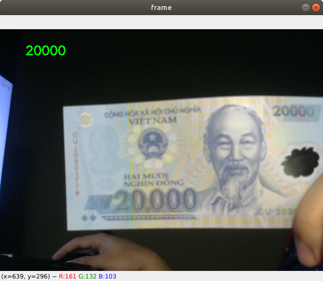

# Phân loại tiền giấy Việt Nam



Notebook này nhằm viết lại bài viết **Nhận dạng tiền Việt Nam với Transfer Learning (VGG16 CNN Classify)** của Mì AI nhằm thay bằng mạng phân loại nhỏ hơn và chuyển đổi qua ONNX để sử dụng với OpenCV DNN.

- Link bài viết: <https://www.miai.vn/2020/04/21/nhan-dang-tien-viet-nam-voi-transfer-learning-vgg16-cnn-classify/>
- Dữ liệu lấy từ Blog Mì AI.

Cảm ơn admin với bài viết rất tâm huyết. Mình viết repo này nhằm đóng góp thêm cho cộng đồng. Anh em có thể thả **Star** tại <https://github.com/vietanhdev/tien-giay-vn>. Thanks :D 

## 1. Huấn luyện 

[](https://colab.research.google.com/github/vietanhdev/tien-giay-vn/blob/master/train.ipynb)

**Chú ý**

- Các bạn có thể huấn luyện nhiều epochs hơn hoặc tinh chỉnh các siêu tham số để có độ chính xác cao hơn. Notebook mình viết chỉ để thử nghiệm việc chạy đã đúng chưa.
- Anh em có thể cải thiện độ chính xác bằng cách thu thêm dữ liệu với nhiều điều kiện hơn nữa.

## 2. Chạy thử

```
pip3 install requirements.txt
python main.py
```

